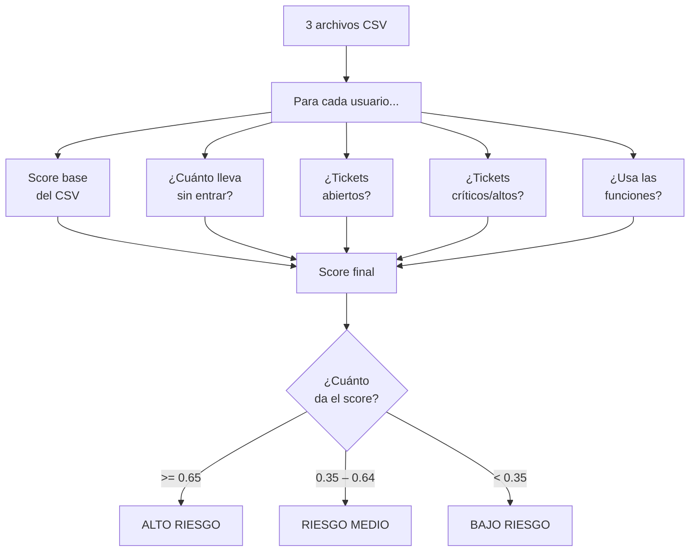

# Algoritmo de Scoring de Churn

## Flujo general



---

## ¿Cuánto suma cada señal?

| Señal                    | Situación                          | Suma al score |
| ------------------------ | ---------------------------------- | :-----------: |
| **Score base** (del CSV) | Siempre                            |     × 0.5     |
| **Inactividad**          | Más de 30 días sin entrar          |     +0.20     |
|                          | Entre 14 y 30 días sin entrar      |     +0.10     |
|                          | Entró recientemente                |     +0.00     |
| **Tickets abiertos**     | Más de 2 tickets sin resolver      |     +0.15     |
|                          | 1 o 2 tickets sin resolver         |     +0.07     |
|                          | Sin tickets abiertos               |     +0.00     |
| **Gravedad tickets**     | Más de 1 ticket crítico o alto     |     +0.15     |
|                          | 1 ticket crítico o alto            |     +0.08     |
|                          | Sin tickets graves                 |     +0.00     |
| **Uso de funciones**     | Usa menos del 20% de lo disponible |     +0.15     |
|                          | Usa entre el 20% y el 40%          |     +0.07     |
|                          | Usa más del 40%                    |     +0.00     |

---

## Ejemplo rápido

```
Usuario X:
  Score base = 0.60  →  0.60 × 0.5 = 0.30
  Sin actividad hace 40 días             +0.20
  Tiene 3 tickets abiertos              +0.15
  1 ticket crítico                      +0.08
  Solo usa el 15% de las funciones      +0.15
                                       ───────
  Score final = 0.88  →  ALTO RIESGO
```

---

## El score máximo posible es ~1.05

> El score base puede llegar a 1.0 (pero se multiplica por 0.5 = máx 0.50).
> Los cuatro penalizadores juntos suman hasta 0.55.
> En la práctica, un score de 0.65 o más ya es una señal de alerta seria.
